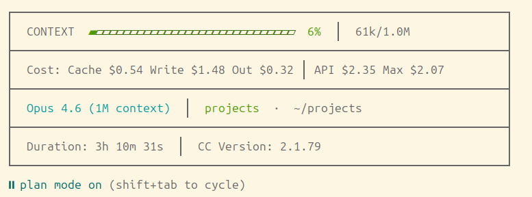

# cc-statusline

A Claude Code statusline that shows context window usage, cost breakdown, and session info in your terminal.



## Features

- **Context** -- progress bar with color thresholds (green < 50%, yellow 50-80%, red > 80%), percentage, and token count (e.g., 61k/1.0M)
- **Cost** -- per-category breakdown: cache reads, cache writes, output tokens in USD. Shows both calculated API total and Anthropic-reported session total
- **Info** -- model name (e.g., "Opus 4.6 (1M context)"), project name, working directory
- **Duration** -- session duration and Claude Code version

## Quick Install

```bash
git clone https://github.com/sirkhet-dev/cc-statusline.git
cd cc-statusline
./install.sh                # interactive — choose slim or full
./install.sh --edition full # direct full install
```

## Manual Install

1. Download the script:

```bash
curl -fsSL https://raw.githubusercontent.com/sirkhet-dev/cc-statusline/main/slim/statusline.sh -o ~/.claude/statusline.sh
```

2. Make it executable:

```bash
chmod +x ~/.claude/statusline.sh
```

3. Add to `~/.claude/settings.json`:

```json
{
  "statusLine": {
    "type": "command",
    "command": "~/.claude/statusline.sh"
  }
}
```

> If `settings.json` already exists, merge the `statusLine` key into your existing config.

## Requirements

- `jq` -- JSON parsing
- `python3` -- cost calculation from transcript
- `bc` -- number formatting

```
apt:    sudo apt install jq python3 bc
brew:   brew install jq python3 bc
pacman: sudo pacman -S jq python bc
```

Full edition also uses:
- `git` -- branch info
- `curl` -- rate limit API

## Uninstall

```bash
./install.sh --uninstall
```

Restores your previous statusline configuration if one existed.

## How It Works

Claude Code pipes a JSON object to the script's stdin on each refresh cycle. The script parses session data with `jq`, calculates API costs by analyzing the transcript file with an embedded Python script (results cached for 5 seconds), and outputs formatted text with box-drawing characters to stdout.

## Customization

You can modify the following in `slim/statusline.sh`:

- **Colors** -- ANSI codes at the top of the script (lines 5-10)
- **Bar width** -- `W=72` variable
- **Pricing** -- `PRICING` dictionary in the embedded Python block

## Full Version

The full edition adds git info, rate limits, effort level, token speed, tool/agent tracking, and todo progress -- all configurable via environment variables.

### Additional Features

- **Git** -- branch name with dirty indicator (`main*`)
- **Effort Level** -- current effort setting with visual icon
- **Rate Limits** -- 5-hour and 7-day usage bars with reset times (Pro/Max/Team)
- **Token Speed** -- output tokens per second
- **Tool Tracking** -- currently running and recently completed tools
- **Agent Tracking** -- running subagents with type and duration
- **Todo Progress** -- task completion count and current task name
- **Session Name** -- custom title or auto-generated slug

### Install Full Edition

```bash
./install.sh --edition full
```

## Configuration

Toggle features with environment variables. Set in `~/.bashrc`, `~/.zshrc`, or your shell profile:

| Variable | Default | Description |
|----------|---------|-------------|
| `CC_SHOW_GIT` | `1` | Git branch + dirty state |
| `CC_SHOW_EFFORT` | `1` | Effort level indicator |
| `CC_SHOW_USAGE` | `1` | Rate limit bars |
| `CC_SHOW_SPEED` | `0` | Output token speed |
| `CC_SHOW_TOOLS` | `0` | Tool activity line |
| `CC_SHOW_AGENTS` | `0` | Agent tracking line |
| `CC_SHOW_TODOS` | `0` | Todo progress line |
| `CC_SHOW_SESSION` | `0` | Session name display |

Example:
```bash
export CC_SHOW_TOOLS=1 CC_SHOW_AGENTS=1 CC_SHOW_TODOS=1
```

Set `0` to disable, any other value to enable.

### Known Limitations

- **Effort level** reads from `~/.claude/settings.json` (persistent setting only). Session-only values like `max` and `auto` (set via `/effort`) are not exposed by Claude Code's statusline API, so they won't appear. Only `low`, `medium`, `high`, and `default` are shown.
- **Tool/Agent/Todo tracking** only shows data when Claude is actively using tools, dispatching agents, or managing tasks. Enable with `CC_SHOW_TOOLS=1 CC_SHOW_AGENTS=1 CC_SHOW_TODOS=1` and ask Claude to perform actions that trigger these features.
- **Rate limits** require a Pro/Max/Team subscription with OAuth login (not API key). The usage API may be temporarily rate-limited; results are cached for 60 seconds on success and 5 minutes on failure.

## License

MIT
